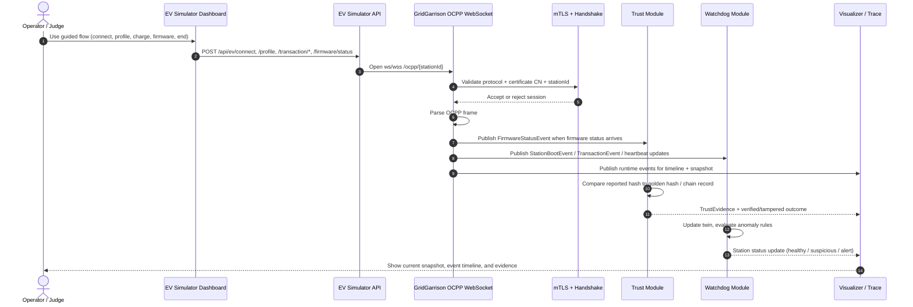

# GridGarrison Technical Project Guide

This document is a technical handoff for the current GridGarrison workspace. It explains what the system does, how the repository is organized, how the backend and EV simulator connect, and how the main flows fit together.

## 1. Project summary

GridGarrison is an EV charging trust and identity platform built for a hackathon demo. The system combines:

- an OCPP-style charging station ingress path,
- mTLS-based station identity enforcement,
- firmware trust verification backed by blockchain concepts,
- in-memory digital twin and anomaly detection,
- a runtime trace visualizer,
- and a separate EV simulator app with a demo dashboard.

The design goal is not a production charger management system. The design goal is a deterministic, explainable demo that can show:

1. a charging station connecting,
2. charging telemetry flowing,
3. firmware trust being verified or rejected,
4. anomalies being detected,
5. and a clear operator-facing trace of what happened.

## 2. High-level architecture

There are two main applications in this workspace:

### 2.1 GridGarrison backend

The backend is the Spring Boot application in the root project. It is the central event hub and owns the following concerns:

- OCPP WebSocket ingress and certificate enforcement,
- trust verification and blockchain access,
- digital twin and anomaly detection,
- visualizer APIs and runtime snapshots,
- shared DTOs and event contracts.

### 2.2 EV simulator app

The EV simulator is a separate Spring Boot application under ev-simulator/simulator-app. It acts like a dummy EV or charging station client and does two jobs:

- connects to the backend over WebSocket using the OCPP endpoint,
- exposes REST controls and a browser dashboard for demo actions.

### 2.3 Runtime relationship

The backend is the source of truth for station identity, event processing, trust, and anomaly response.
The simulator is the client-side demo actor that drives station behavior.

The simplified runtime chain is:

1. Simulator opens WebSocket to backend `/ocpp/{stationId}`.
2. Backend authenticates the connection and validates station identity.
3. Simulator sends OCPP-style frames such as BootNotification, Heartbeat, TransactionEvent, and FirmwareStatusNotification.
4. Backend publishes Spring application events internally.
5. Trust and watchdog modules react to those events.
6. Visualizer surfaces the resulting state and timeline.

### 2.4 System sequence diagram

The diagram below shows the main interactive path from the operator’s action in the EV simulator through backend security, trust, watchdog, and visualizer updates.



## 3. Repository structure

### 3.1 Root-level files

- `pom.xml` — root Maven build for the backend.
- `README.md` — project overview and startup notes.
- `HACKATHON_SYSTEM_GUIDE.md` — earlier architecture and demo planning guide.
- `TEAM_PLAN_CHECKLIST.md` — ownership split and demo acceptance checklist.

### 3.2 Backend source tree

Root backend source path:

- `src/main/java/com/cybersecuals/gridgarrison/`

Main packages:

```text
com.cybersecuals.gridgarrison
├── orchestrator
│   ├── config
│   └── websocket
├── trust
│   ├── contract
│   └── service
├── watchdog
│   └── service
├── visualizer
└── shared
    └── dto
```

### 3.3 Backend resources

- `src/main/resources/application.yml` — primary backend configuration.
- `src/main/resources/solidity/FirmwareRegistry.sol` — Solidity contract source.
- `src/main/resources/static/visualizer.html` — backend visualizer UI.

### 3.4 Backend tests

- `src/test/java/com/cybersecuals/gridgarrison/ModularityVerificationTest.java` — Spring Modulith boundary verification.

### 3.5 EV simulator tree

Simulator app root:

- `ev-simulator/simulator-app/`

Important simulator paths:

- `src/main/java/com/cybersecuals/gridgarrison/simulator/`
- `src/main/resources/application.yml`
- `src/main/resources/static/ev-dashboard.html`

## 4. Backend module responsibilities

## 4.1 Orchestrator module

Purpose:

- receive station-facing traffic,
- validate station identity and protocol requirements,
- translate WebSocket/OCPP frames into internal Spring events.

Key classes:

- `orchestrator/config/MtlsSecurityConfig.java`
- `orchestrator/config/OcppHandshakeInterceptor.java`
- `orchestrator/config/WebSocketConfig.java`
- `orchestrator/websocket/OcppWebSocketHandler.java`
- `orchestrator/websocket/OcppMessage.java`

### `MtlsSecurityConfig`

This class defines the backend security filter chain.

Important behavior:

- `/ocpp/**` requires authentication when SSL is enabled.
- x509 certificate authentication maps the certificate CN to the Spring Security principal.
- `/visualizer/**` may be public or authenticated depending on the `gridgarrison.security.visualizer.public` flag.
- CSRF is disabled for stateless WebSocket and API routes.

This is the main mTLS enforcement layer on the backend.

### `OcppHandshakeInterceptor`

This interceptor validates the WebSocket handshake before the connection becomes active.

It checks:

- that the client advertises `ocpp2.0.1` in `Sec-WebSocket-Protocol`,
- that the `stationId` path segment is present,
- and, when an X.509 certificate is available, that the certificate CN matches the station ID.

If the CN and station ID do not match, the handshake is rejected.

### `OcppWebSocketHandler`

This is the message dispatcher for WebSocket traffic.

It handles:

- `BootNotification`
- `Heartbeat`
- `TransactionEvent`
- `FirmwareStatusNotification`
- `SecurityEventNotification`

It does not directly implement trust or anomaly logic. Instead, it publishes Spring application events so downstream modules can react without direct coupling.

Its main responsibilities are:

- connection lifecycle logging,
- handshake identity verification support,
- OCPP SRPC frame parsing,
- publishing the correct internal event type for each action.

### Event publishing pattern

The orchestrator is the system entry point for station activity. Once it parses a message, it emits an event such as:

- `StationBootEvent`
- `TransactionEvent`
- `FirmwareStatusEvent`
- `SecurityAlertEvent`

Those events feed the trust, watchdog, and visualizer modules.

## 4.2 Trust module

Purpose:

- compare reported firmware hashes against authoritative golden hashes,
- use blockchain-backed data where configured,
- return verified, tampered, or unknown-station outcomes.

Key classes:

- `trust/service/BlockchainService.java`
- `trust/service/BlockchainServiceImpl.java`
- `trust/service/BlockchainTrustService.java`
- `trust/contract/FirmwareRegistryContract.java`

### `BlockchainServiceImpl`

This is the Web3j-backed implementation.

It is responsible for:

- connecting to the configured Ethereum JSON-RPC endpoint,
- loading the deployed `FirmwareRegistry` contract,
- registering golden hashes,
- reading signed baseline data from chain,
- verifying firmware hashes,
- producing trust evidence objects,
- and falling back to deterministic dry-run behavior when blockchain access is unavailable.

Important configuration inputs:

- `gridgarrison.blockchain.rpc-url`
- `gridgarrison.blockchain.private-key`
- `gridgarrison.blockchain.contract-address`
- manufacturer signing keys and IDs from `gridgarrison.trust.manufacturer.*`

Key behavior:

- `verifyGoldenHashWithEvidence(...)` returns both a `FirmwareHash` and a structured trust evidence object.
- If blockchain lookup fails, the code produces an `UNKNOWN_STATION`-style or infrastructure-failure path instead of crashing the demo flow.
- Signed golden hash registration is supported when the record contains manufacturer signature material.

### `FirmwareRegistryContract`

This is the generated Web3j contract wrapper used to call the Solidity contract.

It abstracts the chain interaction so the service layer can call strongly typed methods such as register/read operations instead of hand-encoding ABI calls.

### Trust flow outcome types

The trust path generally resolves to one of these states:

- verified
- tampered
- unknown station
- infrastructure failure / dry-run fallback

These states feed both the visualizer and the watchdog response chain.

## 4.3 Watchdog module

Purpose:

- maintain a digital twin per station,
- track session history and state,
- detect anomalies using simple but deterministic rules.

Key classes:

- `watchdog/service/DigitalTwinService.java`
- `watchdog/service/DigitalTwinServiceImpl.java`
- `watchdog/service/StationTwin.java`

### `DigitalTwinServiceImpl`

This is the in-memory twin engine.

It tracks each station with:

- registration timestamp,
- last heartbeat time,
- recent charging sessions,
- average energy per session,
- anomaly count,
- and twin status.

Detection rules include:

1. Energy spike detection
   - if the latest session energy is more than a configured multiple of baseline average, the station is flagged.
2. Rapid reconnect detection
   - multiple short sessions in a short time window trigger an anomaly.
3. Heartbeat timeout detection
   - if no heartbeat/session update arrives within the configured timeout, the station is flagged.

The watchdog is intentionally simple and deterministic. That makes the hackathon narrative easy to explain.

### Station twin state

`StationTwin` is the snapshot type exposed to the rest of the app. It is a read-friendly representation of the internal mutable twin state.

Typical fields include:

- station ID,
- registration time,
- last heartbeat,
- recent sessions,
- average session energy,
- total anomaly count,
- current twin status.

## 4.4 Visualizer module

Purpose:

- collect runtime trace data,
- expose a snapshot API,
- surface an operator-friendly timeline and component panel,
- support demo buttons for simulated flows.

Key classes:

- `visualizer/RuntimeTraceService.java`
- `visualizer/RuntimeTraceController.java`
- `visualizer/RuntimeEventTap.java`

### `RuntimeTraceService`

This service is the central runtime ledger for the UI.

It stores:

- recent trace events,
- station state snapshots,
- trust evidence by station,
- component state panels,
- generated hashes,
- generated verifications,
- on-chain baseline views.

It also provides deterministic simulation helpers such as:

- normal scenario generation,
- tamper scenario generation,
- anomaly scenario generation,
- current hash generation,
- healthy baseline generation,
- component tamper toggling,
- verification against generated or on-chain baselines.

### `RuntimeTraceController`

This controller exposes the visualizer API under `/visualizer/api`.

Main endpoints:

- `GET /snapshot`
- `GET /events`
- `POST /simulate`
- `POST /simulate-normal`
- `POST /simulate-tamper`
- `POST /simulate-anomaly`
- `POST /simulate-verify`
- `POST /simulate-verify-panel`
- `POST /components/tamper`
- `POST /generate-hash`
- `POST /generate-healthy-hash`
- `DELETE /events`

These endpoints are used by the backend visualizer page and are useful for technical Q&A or reproducible demos.

## 4.5 Shared module

Purpose:

- hold minimal DTOs shared across modules,
- avoid moving module-owned logic into common types.

Key DTOs:

- `shared/dto/ChargingSession.java`
- `shared/dto/FirmwareHash.java`

These are the cross-module data contracts used by orchestrator, trust, watchdog, and visualizer.

## 5. Spring Modulith and module boundaries

The project uses Spring Modulith to protect module boundaries.

The test `ModularityVerificationTest` does two things:

1. `modules.verify()` checks for illegal cross-module access.
2. `Documenter` generates module documentation artifacts in `target/modulith-docs/`.

The practical rule is:

- public APIs and DTOs are shared deliberately,
- implementation classes remain package-private where possible,
- modules communicate through Spring application events rather than direct service calls.

That keeps the architecture clean and makes the demo easier to reason about.

## 6. Backend runtime data flow

## 6.1 WebSocket ingress path

1. The EV simulator connects to `/ocpp/{stationId}`.
2. `OcppHandshakeInterceptor` verifies the protocol and identity.
3. `MtlsSecurityConfig` enforces authentication when SSL/mTLS is enabled.
4. `OcppWebSocketHandler` receives OCPP frames.
5. The handler publishes Spring events.
6. Trust and watchdog listeners react.
7. Visualizer/runtime trace state is updated.

## 6.2 Firmware verification path

1. Simulator or runtime trace emits a `FirmwareStatusNotification`-style event.
2. Trust module receives the event.
3. `BlockchainServiceImpl` loads the golden record and compares hashes.
4. The result becomes verified, tampered, or unknown.
5. Evidence is stored in the runtime trace snapshot.

## 6.3 Digital twin path

1. `StationBootEvent` or session update arrives.
2. Watchdog registers or updates the twin.
3. The twin stores session energy, timing, and heartbeat history.
4. Scheduled and event-driven anomaly checks run.
5. Station status shifts toward healthy, suspicious, or alert depending on the rules.

## 7. EV simulator application

The simulator is a separate Spring Boot app in `ev-simulator/simulator-app`.

Its purpose is to simulate an EV or charging station in a demo-friendly way.

## 7.1 Simulator responsibilities

- open and maintain a persistent WebSocket session to the backend,
- send OCPP-style boot and telemetry messages,
- expose REST endpoints for manual control,
- provide a browser dashboard for demo operation,
- support profile-driven simulation and scenario scripts.

## 7.2 Simulator code structure

Main simulator classes:

- `EvSimulatorApplication` — Spring Boot entry point.
- `EvWebSocketClient` — connection manager and OCPP client.
- `EvClientEndpoint` — WebSocket callback endpoint.
- `EvSimulatorController` — REST API for the dashboard.
- `EvSimulationScenarios` — automated scenario engine.
- `EvTelemetryProfileProperties` — profile config model.

## 7.3 Simulator WebSocket client

`EvWebSocketClient` is the client-side counterpart to the backend OCPP handler.

Current implementation stack:

- Java-WebSocket 1.5.4 (`org.java-websocket`)
- a custom `WebSocketClient` subclass
- SSLContext built from the simulator keystore and truststore for `wss://` mode

It handles:

- connecting to the gateway URI,
- automatic reconnect with backoff,
- sending BootNotification,
- sending Heartbeat,
- sending TransactionEvent frames,
- sending FirmwareStatusNotification frames,
- logging connection state.

The simulator now also includes an ISO-15118 bridge context in TransactionEvent payloads:

- `authorizationMode` (`EIM` or `PlugAndCharge`),
- `contractCertificateId` (for PnC flows),
- `seccId`.

The simulator can operate in:

- `dev-ws` mode using `ws://localhost:8443/ocpp/{stationId}`
- `demo-mtls` mode using `wss://localhost:8443/ocpp/{stationId}` with certificates

The OCPP subprotocol is requested as `ocpp2.0.1`, and the `demo-mtls` station ID is aligned to the certificate CN so the backend can enforce CN-to-station identity matching during the WebSocket handshake.

## 7.4 Simulator REST controller

`EvSimulatorController` exposes the browser/dashboard actions.

Endpoints include:

- `GET /api/ev/status`
- `GET /api/ev/profiles`
- `POST /api/ev/profile?name=...`
- `POST /api/ev/connect`
- `POST /api/ev/disconnect`
- `POST /api/ev/transaction/start`
- `POST /api/ev/transaction/meter`
- `POST /api/ev/transaction/end`
- `POST /api/ev/firmware/status`
- `GET /api/ev/scenario/status`
- `POST /api/ev/scenario/run?name=...`
- `POST /api/ev/scenario/stop`

The controller keeps a local active transaction reference and now clears that state on end/disconnect so the status endpoint does not retain stale IDs.
The status payload includes `stationId`, `connected`, `activeTransactionId`, and `activeProfile`.
The scenario run endpoint validates scenario names before async launch and returns `400` for unknown names.
The firmware status endpoint maps the request parameter `status` into the emitted OCPP firmware payload field `status`.

## 7.5 Simulator scenarios

`EvSimulationScenarios` drives deterministic demo sequences:

- `normalCharging`
- `firmwareTamper`
- `reconnectLoop`

These scenarios are used by the dashboard and by auto-demo flows.

### Scenario behavior

- `normalCharging` sends a golden firmware status and a complete session with metered updates.
- `firmwareTamper` sends a tampered firmware hash and a shorter suspicious session.
- `reconnectLoop` repeatedly disconnects and reconnects to simulate instability.
- `isoPnCHappyPath` runs a Plug-and-Charge session with valid ISO certificate context.
- `isoPnCCertMissing` runs a Plug-and-Charge session missing `contractCertificateId` to trigger policy alerts.

## 7.6 Simulator telemetry profiles

Profiles live in `EvTelemetryProfileProperties` and in `application.yml`.

Current profile intent:

- `normal` — slower cadence, standard energy per update.
- `fast` — faster cadence, more aggressive update timing.

These profiles allow the simulator to behave differently without changing code.

## 8. EV simulator dashboard

The simulator dashboard is `ev-simulator/simulator-app/src/main/resources/static/ev-dashboard.html`.

It is a static HTML/JS UI served by the simulator app itself.

## 8.1 Dashboard design goals

- look dynamic and polished,
- tell a clear 5-step demo story,
- show an EV-like visual model,
- expose live telemetry values,
- preserve technical controls for power users.

## 8.2 Dashboard sections

1. Simulator URL + polling controls
2. Step rail for the demo flow
3. Live EV state summary
4. Animated EV model and charging beam
5. Telemetry cards for battery, temperature, speed, and charge power
6. Guided demo controls
7. Scenario runner
8. Firmware signal controls
9. Event timeline and API response panel
10. Advanced raw controls for technical fallback use

## 8.3 Dashboard data model

The UI reads:

- `/api/ev/status`
- `/api/ev/scenario/status`
- `/api/ev/profiles`

It writes through the REST control endpoints listed above.

The dashboard also simulates some visual telemetry locally:

- battery percent,
- temperature,
- speed,
- charge power.

These visuals are derived from connection/session/profile state so the UI feels active even though the actual backend telemetry is message-driven.

## 9. Configuration files

## 9.1 Backend `application.yml`

Important backend settings:

- server port `8443`
- SSL key store and trust store for mTLS
- blockchain RPC URL, contract address, wallet key
- manufacturer trust keys and IDs
- watchdog heartbeat and sweep interval
- visualizer public/private toggle

The backend supports profile overrides such as `dev-ws` and `demo-mtls`.

## 9.2 Simulator `application.yml`

Important simulator settings:

- server port `8080`
- station ID
- gateway URI
- heartbeat interval
- telemetry profiles
- reconnect policy
- auto-scenarios toggle
- TLS store paths for `wss` mode

The simulator also supports `dev-ws` and `demo-mtls` profiles.

## 10. Event and contract flow

The system is event-driven.

The main internal event flow is:

1. Orchestrator receives protocol frame.
2. Orchestrator emits a Spring application event.
3. Trust module listens for firmware-related events.
4. Watchdog listens for session and boot events.
5. Visualizer listens for runtime state updates and snapshots.

This keeps the modules decoupled while still producing a coherent live story.

## 11. Security model

Security is layered.

### 11.1 Transport security

- `wss` plus TLS can be enabled for the OCPP channel.
- The backend uses server SSL configuration in `application.yml`.

### 11.2 Client identity

- mTLS extracts the X.509 CN.
- The CN is used as the station principal.
- The handshake interceptor rejects mismatches between certificate CN and station ID.

### 11.3 Protocol gating

- The WebSocket handshake requires the OCPP `ocpp2.0.1` subprotocol.

### 11.4 Trust verification

- Firmware hashes are checked against the blockchain-backed golden record.
- If the blockchain RPC is unavailable, the system falls back to deterministic dry-run evidence instead of blocking the demo.

### 11.5 Runtime containment

- Visualizer routes can be public or authenticated depending on config.
- CSRF is disabled for stateless API/WebSocket routes.

## 12. Demo flows and narrative

Recommended demo flow:

1. Start backend.
2. Start simulator.
3. Open the simulator dashboard.
4. Connect the EV.
5. Set a profile.
6. Start charging.
7. Send one or more meter updates.
8. Send firmware status.
9. End the session.
10. Optionally run a tamper or reconnect scenario.

The backend visualizer can be used to show internal evidence and event history, while the simulator dashboard can be used to drive the charging story.

## 13. Acceptance and verification notes

Verified locally in the current workspace:

- backend boots on `8443` in `dev-ws` and `demo-mtls` modes,
- simulator boots on `8080`,
- simulator connects successfully to backend over `ws://localhost:8443/ocpp/{stationId}` in `dev-ws`,
- the guided transaction flow succeeds,
- `transaction/end` now clears the active transaction ID,
- mTLS identity checks reject mismatched station IDs,
- dashboard renders with the new dynamic EV cockpit layout.

## 14. Practical file guide

### Backend files that matter most

- `src/main/java/com/cybersecuals/gridgarrison/orchestrator/config/MtlsSecurityConfig.java`
- `src/main/java/com/cybersecuals/gridgarrison/orchestrator/config/OcppHandshakeInterceptor.java`
- `src/main/java/com/cybersecuals/gridgarrison/orchestrator/websocket/OcppWebSocketHandler.java`
- `src/main/java/com/cybersecuals/gridgarrison/trust/service/BlockchainServiceImpl.java`
- `src/main/java/com/cybersecuals/gridgarrison/watchdog/service/DigitalTwinServiceImpl.java`
- `src/main/java/com/cybersecuals/gridgarrison/visualizer/RuntimeTraceService.java`
- `src/main/java/com/cybersecuals/gridgarrison/visualizer/RuntimeTraceController.java`
- `src/test/java/com/cybersecuals/gridgarrison/ModularityVerificationTest.java`

### Simulator files that matter most

- `ev-simulator/simulator-app/src/main/java/com/cybersecuals/gridgarrison/simulator/EvWebSocketClient.java`
- `ev-simulator/simulator-app/src/main/java/com/cybersecuals/gridgarrison/simulator/EvSimulatorController.java`
- `ev-simulator/simulator-app/src/main/java/com/cybersecuals/gridgarrison/simulator/EvSimulationScenarios.java`
- `ev-simulator/simulator-app/src/main/java/com/cybersecuals/gridgarrison/simulator/EvTelemetryProfileProperties.java`
- `ev-simulator/simulator-app/src/main/resources/static/ev-dashboard.html`
- `ev-simulator/simulator-app/src/main/resources/application.yml`

## 15. Suggested reading order for a new technical contributor

1. Read this guide.
2. Read `README.md` at the repo root.
3. Read `HACKATHON_SYSTEM_GUIDE.md` for architecture intent.
4. Read `TEAM_PLAN_CHECKLIST.md` for ownership boundaries.
5. Read `MtlsSecurityConfig`, `OcppHandshakeInterceptor`, and `OcppWebSocketHandler`.
6. Read `BlockchainServiceImpl`.
7. Read `DigitalTwinServiceImpl`.
8. Read `RuntimeTraceService` and `RuntimeTraceController`.
9. Read the simulator controller, scenarios, and dashboard.

## 16. Key implementation principle

The project is optimized for a live hackathon demo:

- deterministic outcomes,
- clean operator storytelling,
- minimal runtime dependencies where possible,
- and strong separation between transport, trust, anomaly detection, and presentation.

That is the main lens to use when reading or extending the codebase.

## 17. mTLS certificate setup for the demo-mtls profile

This section is the concrete setup recipe for the operator-facing mTLS demo.

### 17.1 Certificate files to generate

Recommended file set:

- `ca.jks` — CA keypair and self-signed CA certificate
- `server.jks` — backend server keypair and certificate signed by the CA
- `ev-sim.jks` — EV simulator keypair and certificate signed by the CA
- `truststore.jks` — CA-only truststore used by both apps at runtime

Important note:

- keep `ca.jks` outside the application resources tree because it contains the CA private key,
- only the runtime keystore/truststore artifacts should be copied into `src/main/resources/certs/`.

### 17.2 Exact keytool commands

The commands below assume Windows PowerShell or cmd.exe with `keytool` on the PATH.

#### Step 1 — create the CA keystore

```powershell
keytool -genkeypair -alias gridgarrison-ca -keystore ca.jks -storetype JKS -keyalg RSA -keysize 4096 -validity 3650 -dname "CN=GridGarrison-CA, OU=GridGarrison, O=GridGarrison, L=Local, S=Local, C=US" -ext bc=ca:true
```

#### Step 2 — export the CA certificate

```powershell
keytool -exportcert -alias gridgarrison-ca -keystore ca.jks -storetype JKS -file ca.cer
```

#### Step 3 — create the backend server keystore for `CN=localhost`

```powershell
keytool -genkeypair -alias gridgarrison-server -keystore server.jks -storetype JKS -keyalg RSA -keysize 2048 -validity 825 -dname "CN=localhost, OU=GridGarrison, O=GridGarrison, L=Local, S=Local, C=US" -ext SAN=dns:localhost,ip:127.0.0.1
```

#### Step 4 — generate a CSR for the server certificate

```powershell
keytool -certreq -alias gridgarrison-server -keystore server.jks -storetype JKS -file server.csr
```

#### Step 5 — sign the server CSR with the CA

```powershell
keytool -gencert -alias gridgarrison-ca -keystore ca.jks -storetype JKS -infile server.csr -outfile server-signed.cer -validity 825 -ext KU=digitalSignature,keyEncipherment -ext EKU=serverAuth -ext SAN=dns:localhost,ip:127.0.0.1
```

#### Step 6 — import the CA cert and signed server cert into `server.jks`

```powershell
keytool -importcert -alias gridgarrison-ca -file ca.cer -keystore server.jks -storetype JKS -noprompt
keytool -importcert -alias gridgarrison-server -file server-signed.cer -keystore server.jks -storetype JKS -noprompt
```

#### Step 7 — create the EV simulator keystore for `CN=EV-Simulator-001`

```powershell
keytool -genkeypair -alias ev-simulator -keystore ev-sim.jks -storetype JKS -keyalg RSA -keysize 2048 -validity 825 -dname "CN=EV-Simulator-001, OU=GridGarrison, O=GridGarrison, L=Local, S=Local, C=US"
```

#### Step 8 — generate a CSR for the EV simulator certificate

```powershell
keytool -certreq -alias ev-simulator -keystore ev-sim.jks -storetype JKS -file ev-sim.csr
```

#### Step 9 — sign the EV simulator CSR with the CA

```powershell
keytool -gencert -alias gridgarrison-ca -keystore ca.jks -storetype JKS -infile ev-sim.csr -outfile ev-sim-signed.cer -validity 825 -ext KU=digitalSignature,keyEncipherment -ext EKU=clientAuth
```

#### Step 10 — import the CA cert and signed EV cert into `ev-sim.jks`

```powershell
keytool -importcert -alias gridgarrison-ca -file ca.cer -keystore ev-sim.jks -storetype JKS -noprompt
keytool -importcert -alias ev-simulator -file ev-sim-signed.cer -keystore ev-sim.jks -storetype JKS -noprompt
```

#### Step 11 — create the runtime truststore

```powershell
keytool -importcert -alias gridgarrison-ca -file ca.cer -keystore truststore.jks -storetype JKS -noprompt
```

#### Optional pinning step

If you also want the simulator to explicitly pin the server certificate in addition to trusting the CA, export the server cert and import it into the simulator truststore:

```powershell
keytool -exportcert -alias gridgarrison-server -keystore server.jks -storetype JKS -file server.cer
keytool -importcert -alias gridgarrison-server -file server.cer -keystore truststore.jks -storetype JKS -noprompt
```

Recommended practice is still CA-based trust rather than certificate pinning.

### 17.3 Where to place the runtime files

Copy the runtime artifacts only, not the CA private keystore, into the application resources trees.

#### Backend

Place these files under:

- `src/main/resources/certs/server.jks`
- `src/main/resources/certs/truststore.jks`

#### EV simulator

Place these files under:

- `ev-simulator/simulator-app/src/main/resources/certs/ev-sim.jks`
- `ev-simulator/simulator-app/src/main/resources/certs/truststore.jks`

#### Keep outside the app resources

- `ca.jks`
- `ca.cer`
- CSR files
- intermediate signed certificate files

### 17.4 Updated backend `demo-mtls` profile

The backend mTLS profile should now explicitly point at the JKS keystore and truststore.

```yaml
---
spring:
   config:
      activate:
         on-profile: demo-mtls
   ssl:
      enabled: true

server:
   ssl:
      enabled: true
      key-store: classpath:certs/server.jks
      key-store-type: JKS
      key-store-password: ${GG_SERVER_KS_PASSWORD:changeit}
   key-alias: server
      client-auth: ${GG_CLIENT_AUTH:want}
      trust-store: classpath:certs/truststore.jks
      trust-store-type: JKS
      trust-store-password: ${GG_CA_TS_PASSWORD:changeit}
```

### 17.5 Updated simulator `demo-mtls` profile

The simulator profile should use the EV certificate and the matching CN.

```yaml
---
spring:
   config:
      activate:
         on-profile: demo-mtls

ev:
   simulator:
      station-id: EV-Simulator-001
      gateway-uri: wss://localhost:8443/ocpp/{stationId}
      tls:
         enabled: true
         key-store-path: classpath:certs/ev-sim.jks
         key-store-password: changeit
         key-store-type: JKS
         trust-store-path: classpath:certs/truststore.jks
         trust-store-password: changeit
         trust-store-type: JKS
```

### 17.6 EV client SSLContext build path

The simulator client already follows the required SSLContext pattern:

1. load the keystore with `KeyManagerFactory`,
2. load the truststore with `TrustManagerFactory`,
3. build an `SSLContext`,
4. attach the SSL context before opening the `wss://` connection.

That is the correct end-to-end shape for the demo client.

### 17.7 Why the CN must match the station ID

The backend handshake interceptor compares:

- certificate CN,
- and the `stationId` path segment in `/ocpp/{stationId}`.

For the demo-mtls profile to succeed, these must match exactly.

With the configuration above, the simulator station ID is `EV-Simulator-001` and the EV client certificate CN is also `EV-Simulator-001`.

### 17.8 Manual verification steps

#### Positive case — should connect

1. Start the backend with `demo-mtls`.
2. Start the simulator with `demo-mtls`.
3. Confirm the simulator logs show a WebSocket connection to `wss://localhost:8443/ocpp/EV-Simulator-001`.
4. Confirm the backend logs show the station connected and the boot notification accepted.

Expected result:

- handshake accepted,
- WebSocket session opens,
- BootNotification receives an Accepted response.

#### Negative case — should reject

1. Change the simulator `station-id` to a different value than the certificate CN, for example `CS-999-EV`.
2. Keep the certificate CN at `EV-Simulator-001`.
3. Restart the simulator.

Expected result:

- the handshake is rejected by the backend interceptor,
- the simulator reports a handshake error or 101 upgrade failure,
- the backend logs a CN/station mismatch rejection.

#### Quick API verification

After a successful session end, `GET /api/ev/status` should return:

- `stationId: <configured-station-id>`,
- `connected: true` or `false` depending on the current socket,
- `activeProfile: fast|normal`,
- `activeTransactionId: null` after `transaction/end`.

That confirms the simulator state is not carrying stale sessions.

## 18. Automated mTLS handshake tests

Automated handshake verification is implemented in:

- `src/test/java/com/cybersecuals/gridgarrison/orchestrator/config/OcppHandshakeInterceptorTest.java`

Covered scenarios:

1. Accept when `Sec-WebSocket-Protocol` includes `ocpp2.0.1` and cert CN matches `/ocpp/{stationId}`.
2. Reject when cert CN and `stationId` mismatch.
3. Reject when required OCPP subprotocol is missing.
4. Reject when client certificate subject contains no CN.

Run only this test class:

```powershell
mvn -Dtest=OcppHandshakeInterceptorTest test
```
